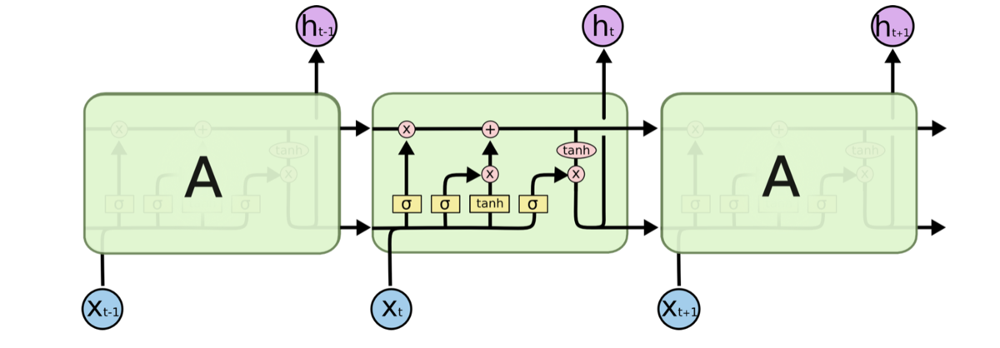

循环神经网络(RNN)是处理文本任务的一个很好的模型结构，LSTM是在缓解RNN梯度消失和梯度爆炸问题的一个改进版，那么具体来说有那么几个问题

1. 什么是RNN
2. 为甚么RNN有梯度消失和梯度爆炸问题
3. 如何解决RNN的梯度消失和梯度爆炸问题
4. 什么是LSTM
5. LSTM为什么能够一定程度上缓解梯度消失和爆炸问题
6. RNN中的Dropout，用于处理过拟合

<!-- more -->

## 什么是RNN

$$
net_t = Ux_t + Wh_{t-1}
$$

$$
h_t = f(net_{t-1})
$$

$$
y = g(Vh_t)
$$

这就是RNN的所有公式，其中的$f(.)$和$g(.)$ 是指某种激活函数

## 为什么RNN有梯度消失和梯度爆炸的问题

如果从一个比较严谨的角度上，应该像百面机器学习那本书中的推导一样，但是这里只给出一个直观的解释。

当假设$f(.)$和$g(.)$都不存在，那么
$$
\frac{\partial net_t}{\partial net_1} = \frac{\partial net_t}{\partial net_{t-1}}\dot{\frac{\partial net_{t-1}}{\partial net_{t-2}}} = W \dot{\frac{\partial net_{t-1}}{\partial net_{t-2}}} = W^n
$$
其中n是这个文本的长度。

也就是说对于$W$的初始值的选择有比较大的影响。

因为当我们在使用CNN的时候，实际上，初始化这个权重的时候是按照某种分布来做的，每个$W$都是不同的，但是在RNN中，是通过BPTT(Back Propagation Through Time, 基于时间的反向传播)算法实现的，其结构决定了不同位置的$W$都是相同的。所以会出现这个问题

对于梯度爆炸的问题，其实不是很难解决，最简单的就是通过梯度裁剪来做，当求解梯度的时候，发现梯度大于某个数值的时候，强制钳制到某个大小。

但是梯度消失的问题，就没有那么简单了，可以通过深度残差网络来解决？这种解决方式就有点类似于LSTM，可能直接就通过GRU或者LSTM来解决梯度消失的问题了。

其实这里的举例也验证了，如果使用Relu激活函数，并且将$W$初始化成单位矩阵，能一定程度上缓解梯度消失和爆炸的问题。(这就是另一个问题了)

## 如何解决RNN的梯度消失问题(一部分)

> 对于梯度爆炸的问题，其实不是很难解决，最简单的就是通过梯度裁剪来做，当求解梯度的时候，发现梯度大于某个数值的时候，强制钳制到某个大小。
>
> 但是梯度消失的问题，就没有那么简单了，可以通过深度残差网络来解决？这种解决方式就有点类似于LSTM，可能直接就通过GRU或者LSTM来解决梯度消失的问题了。

## 什么是LSTM

建议参考更加全面的介绍[博文](https://www.jianshu.com/p/95d5c461924c)， 这里制作非常简略的记录

这里面有几个值得介绍的门结构

1. 输入门$i_t$
   $$
   i_t = \sigma(W_t x_t + U_t h_{t-1} + b_i)
   $$
   
2. 遗忘门$f_t$
   $$
   f_t = \sigma(W_fx_t + U_f h_{t-1} + b_f)
   $$

3. 输出门$o_t$
   $$
   o_t = \sigma(W_o x_t +U_o h_{t-1} + b_o)
   $$
   
4. 内部记忆单元$c_t$ 
   $$
   \hat{c_t}=\tanh(W_c x_t + U_c h_{t-1})
   $$

   $$
   c_t = f_t \odot c_{t-1} + i_t \odot{\hat{c_t}}
   $$

   那么之前RNN中的$h_t$应该表述成
   $$
   h_t = o_t \odot {\tanh(c_t)}
   $$

这些公式看上去有些复杂，但是除了记忆单元之外，其他的都还是挺直观的。其中$\sigma$的值域在0到1之间，他们最终其实只用于内部记忆单元的计算中。

并且这三个门的名字，输入门的意思是对当前输入的记忆的限制，所谓的遗忘门是指对上一个时刻的记忆的遗忘，这两个共同组合成为当前时刻的记忆。至于输出门，是对当前记忆的输出的一个限制。

其实这也能看出来，所有的限制都是0到1之间，其他的$\tanh$这些激活函数都是用来生成记忆的。

一般情况下，对于限制，或者说 输入门，遗忘门，输出门，一般采用sigmoid。$\tanh$的值域是-1到1，一方面是因为这个函数是以0为中心的，并且在输入时0的情况下的比sigmoid有更大的梯度。另外一方面，这也是现代的LSTM模型实践下的结果(使用$\tanh$效果更好)

有些时候，在资源比价有限的情况下，门限也可以采用类似阈值硬切0和1.

LSTM的实际应用结构有很多变种，其实也没有必要完全记下来。

## 为什么LSTM能够解决梯度消失和爆炸的问题(准确来说是减缓)

参考[在此](https://www.zhihu.com/question/34878706)

大概是说，LSTM在结构上，通过遗忘门 输入门的限制，使得，最终的隐状态的信息传输路径有多条，它事实上减缓了梯度消失的问题。或许我们不应该将这个问题看的这么严重，~~或者说(个人理解)LSTM是在逻辑上讲了一个好故事，符合人类的思维，如果只使用RNN那种原始结构，它不符合实际，所以它会出现梯度消失的问题，梯度消失的问题可能只是结果(不符合人类思维的结果)，而不是因为梯度消失导致结果不好, 或者说效果不好和梯度消失都是结构不合理的结果。(个人乱说的，仅供参考)~~

在百面深度学习这本书中，也讲到了这个梯度消失和爆炸的问题。但是是从信息传播的角度，也就是长期信息记忆的角度来看的，这个似乎能够更直观的通过模型结构而不是单纯的去理解梯度消失梯度爆炸这个角度来看。

## Dropout抑制过拟合

参考自百面深度学习这本书

随即丢弃这个方法本身经常应用在常见的卷积神经网络中，不是特别常出现在循环神经网络中，这也是有一定的道理的，后面说。这里先说一下为什么dropout是有效的。

事实上，dropout是一种正则化的方法，来缓解过拟合问题。

1. 看作是集成了大量的神经网络之后进行了bagging操作。在训练的时候，随机使用部分的神经元进行训练，但是预测的时候，则综合了所有的神经元的结果。在原始的bagging中，所有的模型是独立的，但是对于神经网络中的dropout，则是共享了所有的参数。
2. dropout减少了神经元之间的共适应关系。由于训练中会随机丢弃神经元，这也就意味着，在训练的时候，某个神经元不太会在一某个特定神经元的输出，不会依赖于隐节点之间的固定关系

那么如何在循环神经网络中使用dropout策略？这里有两个概念

1. 前馈连接：从t时刻的输入到t时刻输出直接的连接
2. 循环连接：从t时刻到t+1时刻之间的连接

现在已经从实验结果中证明了采用基于变分推理的Dropout方法，即对一个序列，在其所有时刻的循环连接上采用相同的丢弃方式，也就是说在不同时刻丢去的连接时相同的，在这种情况下在语言模型和情感分析中效果比较好。

但是我个人觉着，dropout在RNN(包括LSTM、GRU)中用处不是很大，再说现在RNN在文本应用中也不太常见了，BERT那一套东西实在是太成熟了。

