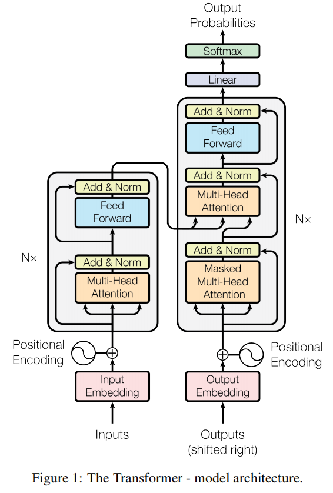
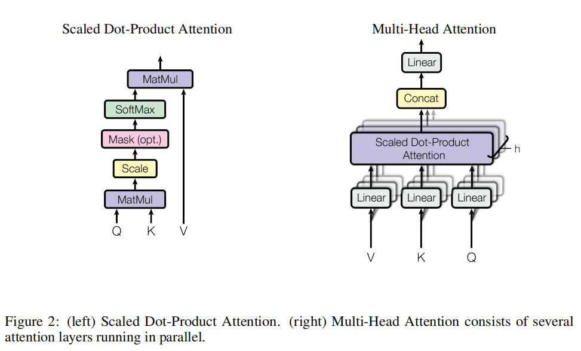
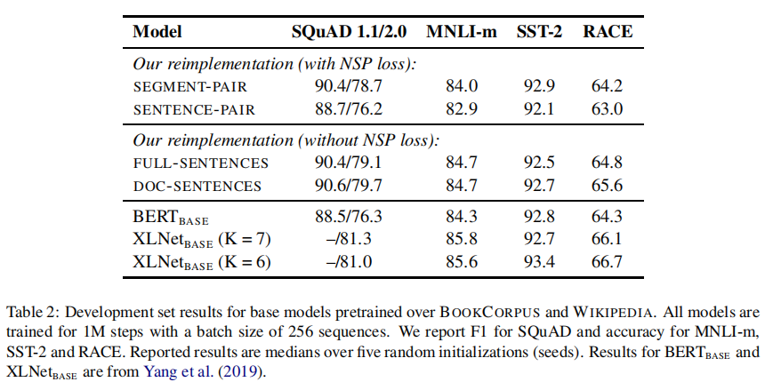
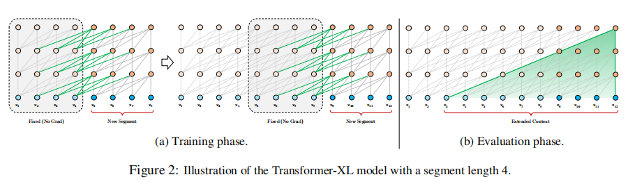
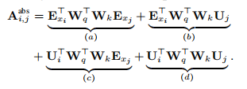
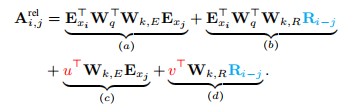
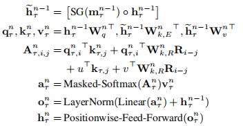
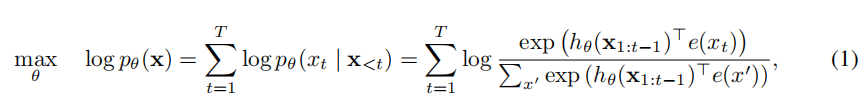
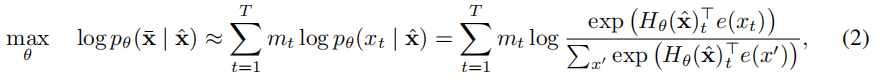
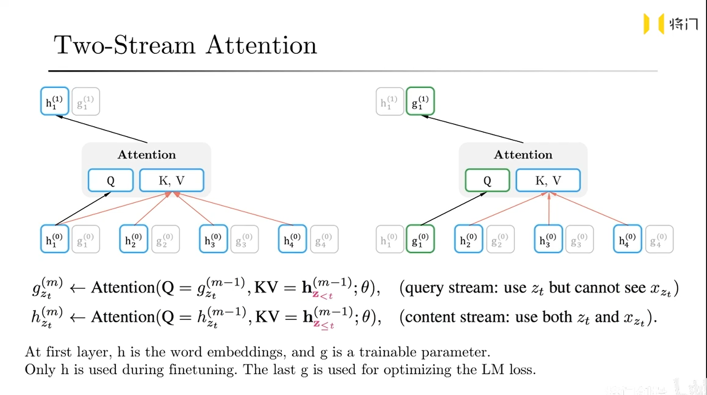

这里主要介绍一些常见的预训练模型背后的模型，比如Bert，RoBERTa, Transformer-XL, XLNet, ~~ELECTRA~~ 。至于现在能写到哪里就算是到哪里吧

<!-- more-->

## BERT

参考论文:

-  **Attention Is All You Need** : 2017年发表
- **BERT: Pre-training of Deep Bidirectional Transformers for Language Understanding**： 2018/2019

RNN/LSTM这之类的模型中任意两个输入或者输出之间的操作是和他们的距离成正比的，这就使得模型很难学习到这些长距离的关系。这正是attention(准确是多头注意力)出现的主要原因，在此处中的transformer其实只依赖于self-attention



- encoder：包含$N = 6$个这样的结构。这个结构分为两个sub-layer结构，第一个sub-layer就是multi-head self-attention。第二个sub-layer就是简单的position-wise fully connected feed-forward network。其实每个sub-layer结构都会有一个residual connection(残差连接)，然后在进行normalization。也就是$LayerNorm(x + Sublayer(x))$.
- decoder：也包含这样6个这样的结构

所谓的attention其实就是如下的结构



单个的attention(具体来说scaled Dot-Product Attention)其实就是：
$$
Attention(Q,K,V) = softmax(\frac{QK^T}{\sqrt{d_k}})V
$$
其中的softmax中的除以的分母就是scale. 做这个的目的还是因为$QK^T$这个操作会使得结果矩阵中的每个数字变得比较大，除以$\sqrt{d_k}$可以一定程度上缓解这个问题。

至于多头是指
$$
MultiHead(Q, K, V) = Concat(head_1, head_2, ..., head_h)W^O
$$
where
$$
head_i = Attention(QW_i^Q, KW_i^K, VW_i^V)
$$
在这篇文章中，transformer将多头的注意力机制的使用方式分为三种

- 在`encoder-decoder attention`层中，query来自于上一个decoder layer中的内容，key和value是来自于encoder的输出。
- encoder包含这self-attention层。这些部分的所有的key和value以及query都是来自于相同的地方，也就是encoder上一层中的输出。
- 当然在decoder中，self-attention来时允许来自当前位置及其左侧的内容，所以需要进行一系列的屏蔽mask操作，其实就是mask成$-\infin$. 这样的话，才能在softmax之后，将这个位置的给屏蔽掉。

使用代码实现应该如下(这里的`einsum`用的真是出神入化，此外，这部分代码来自于transformer-xl的部分，这里还有些迷惑性的操作，比如`forward`中的`c`和`h`以及`mems`，个人感觉只是为了transformer-xl本身的需要，而不是原始的transformer的需要；不清楚抱抱脸那个是怎么实现的)：

```python
class MultiHeadAttn(nn.Module):
    def __init__(self, n_head, d_model, d_head, dropout, dropatt=0, 
                 pre_lnorm=False):
        super(MultiHeadAttn, self).__init__()

        self.n_head = n_head
        self.d_model = d_model
        self.d_head = d_head
        self.dropout = dropout

        self.q_net = nn.Linear(d_model, n_head * d_head, bias=False)
        self.kv_net = nn.Linear(d_model, 2 * n_head * d_head, bias=False)

        self.drop = nn.Dropout(dropout)
        self.dropatt = nn.Dropout(dropatt)
        self.o_net = nn.Linear(n_head * d_head, d_model, bias=False)

        self.layer_norm = nn.LayerNorm(d_model)

        self.scale = 1 / (d_head ** 0.5)

        self.pre_lnorm = pre_lnorm

    def forward(self, h, attn_mask=None, mems=None):
        ##### multihead attention
        # [hlen x bsz x n_head x d_head]

        if mems is not None:
            c = torch.cat([mems, h], 0)
        else:
            c = h

        if self.pre_lnorm:
            ##### layer normalization
            c = self.layer_norm(c)

        head_q = self.q_net(h)
        head_k, head_v = torch.chunk(self.kv_net(c), 2, -1)

        head_q = head_q.view(h.size(0), h.size(1), self.n_head, self.d_head)
        head_k = head_k.view(c.size(0), c.size(1), self.n_head, self.d_head)
        head_v = head_v.view(c.size(0), c.size(1), self.n_head, self.d_head)

        # [qlen x klen x bsz x n_head]
        attn_score = torch.einsum('ibnd,jbnd->ijbn', (head_q, head_k))
        attn_score.mul_(self.scale)
        if attn_mask is not None and attn_mask.any().item():
            if attn_mask.dim() == 2:
                attn_score.masked_fill_(attn_mask[None,:,:,None], -float('inf'))
            elif attn_mask.dim() == 3:
                attn_score.masked_fill_(attn_mask[:,:,:,None], -float('inf'))

        # [qlen x klen x bsz x n_head]
        attn_prob = F.softmax(attn_score, dim=1)
        attn_prob = self.dropatt(attn_prob)

        # [qlen x klen x bsz x n_head] + [klen x bsz x n_head x d_head] -> [qlen x bsz x n_head x d_head]
        attn_vec = torch.einsum('ijbn,jbnd->ibnd', (attn_prob, head_v))
        attn_vec = attn_vec.contiguous().view(
            attn_vec.size(0), attn_vec.size(1), self.n_head * self.d_head)

        ##### linear projection
        attn_out = self.o_net(attn_vec)
        attn_out = self.drop(attn_out)

        if self.pre_lnorm:
            ##### residual connection
            output = h + attn_out
        else:
            ##### residual connection + layer normalization
            output = self.layer_norm(h + attn_out)

        return output
```

前面解释了多头感知机，另外一个部分就是后面所谓的`Position-wise Feed-Forward Networks`，写作公式应该是
$$
FFN(x) = max(0, xW_1 + b_1)W_2 + b_2
$$
使用代码描述就是

```python
class FeedForward(nn.Module):
    def __init__(self, d_model, d_ff=2048, dropout = 0.1):
        super().__init__() 
    
        # We set d_ff as a default to 2048
        self.linear_1 = nn.Linear(d_model, d_ff)
        self.dropout = nn.Dropout(dropout)
        self.linear_2 = nn.Linear(d_ff, d_model)
    
    def forward(self, x):
        x = self.dropout(F.relu(self.linear_1(x)))
        x = self.linear_2(x)
        return x
```

Embedding and Softmax： 没太看懂啥意思。好奇的话，看原始论文吧

> In our model, we share the same weight matrix between the two embedding layers and the pre-softmax √ linear transformation,
>
> 不知道说的啥

另外, 和之前一样, 在embedding层那部分也除了$\sqrt{d_{model}}$

Position Embedding，这个主要是为了解决attention结构中无法体现位置信息的缺点而加上的。简单来说其实就是

$$
PE(pos, 2i) = sin(pos/10000^{2i/d_{model}})
$$

$$
PE(pos, 2i+1) = cos(pos/10000^{2i/d_{model}})
$$

```python
class PositionalEncoder(nn.Module):
    def __init__(self, d_model, max_seq_len = 200, dropout = 0.1):
        super().__init__()
        self.d_model = d_model
        self.dropout = nn.Dropout(dropout)
        # create constant 'pe' matrix with values dependant on 
        # pos and i
        pe = torch.zeros(max_seq_len, d_model)
        for pos in range(max_seq_len):
            for i in range(0, d_model, 2):
                pe[pos, i] = \
                math.sin(pos / (10000 ** ((2 * i)/d_model)))
                pe[pos, i + 1] = \
                math.cos(pos / (10000 ** ((2 * (i + 1))/d_model)))
        pe = pe.unsqueeze(0) # 做这个是因为来的是一个batch, 要让前面让出一维进行广播
        self.register_buffer('pe', pe)
 
    
    def forward(self, x):
        # make embeddings relatively larger
        x = x * math.sqrt(self.d_model)
        #add constant to embedding
        seq_len = x.size(1)
        pe = Variable(self.pe[:,:seq_len], requires_grad=False)
        if x.is_cuda:
            pe.cuda()
        x = x + pe
        return self.dropout(x)
```

为什么采用self-attention

主要是和rnn和卷积来比较的, 从 

1. 每一层的复杂度
2. 计算能否并行化
3. 网络中两个长依赖的路径的长度

略,实际上我也没太看明白

训练流程（参考性不太强，因为它的训练时task-specify的，这可能是为什么后来又了BERT的原因）：

1. 优化器Adam, $\beta_1=0.9, \beta_2 = 0.98, \epsilon=10^{-9}$
2. $lrate = d_{model}^{-0.5}\cdot{min(step\_num^{-0.5}, step\_num\cdot{warmup\_steps^{-1.5}})}$, 其中$warmup_steps = 4000$, 训练步骤大概为300000个step
3. 在每次加到sub-layer的输入之前或者normalized之前都会进行dropout，同时在加embedding的时候，包括encoder和decoder的时候也进行了dropout，$P_{drop}=0.1$

----

接下来继续介绍BERT相关的东西了，上面还都是介绍Transformer

> BERT: Pre-training of Deep Bidirectional Transformers for Language Understanding
>
> 简单来说，使用了Transformer结构的预训练模型

预训练语言模型的常见种类(随便看看)

1. 无监督feature-based方法。典型例子：ELMo，简单介绍，和BERT十分像，但是BERT使用Transformer来作为基准的模型结构，但是ELMo使用的双向LSTM。个人觉着：这里是想强调，使用ELMo来生成特征向量，然后就进行下层的具体任务了，不会再训练ELMo这个模型本身了
2. 无监督Fine-tuneing方法。典型例子，OpenAI的GPT，这个模型十分神奇，它使用了Transformer这种结构，准确来说只用到了之前提到的Transformer的decoder部分。它与训练的时候，使用前面的文字来预测下一个文字，也就是说对于i位置的文字的生成(没错，就是`Improving Language Understandingby Generative Pre-Training`中的`Generative`)不会参考i+1及其之后的内容。他事实上并没有什么神奇的，但是它确实是BERT之前就出现的与训练语言模型，BERT反而是后面来的。关于ELMo到GPT再到BERT的演进，可以看[此处](https://zhuanlan.zhihu.com/p/54578457)。个人感觉：这里是想强调，这里使用与训练好的GPT模型，添加或者不添加额外的模型结构或者冻结或者不冻结现有结构等等方法，然后使用它本身训练的方法来在此在你本身的数据集上做一下微调。
3. 从监督数据中来进行迁移学习。个人感觉：就是使用模型，在添加额外的下游任务层(或者不添加)，根据下游任务的标签来做迁移学习某些层或者全部层的东西。

BERT：1. pre-training(与训练). 2. fine-tuning(微调). 具体来说，先在无标签的数据上进行与训练。然后再fine-tuning的阶段，BERT模型先初始化成这些预训练好的参数，这些参数再使用有标签的数据进行具体的下游任务进行训练。(废话)

BERT预训练是通过两个不同的任务来做的

1. **Masked LM**, 其实就是随机mask掉一些token，然后预测这些token。在BERT原始实验中，mask掉15%的wordpiece过的token，然后最终预测求loss的时候，只算那些被mask掉的部分的预测结果。因为在fine-tune阶段的时候，看不到[MASK]这个token，所以说，这里的做法是如果一个词需要被mask掉了，那么这个词有80%的实践使用`[MASK]`提到，10%的时候，使用随机的token来替代，10%的时间不改变这个词。
2. **Next Sentence Prediction (NSP)**。这个就简单了点，就是使用`[CLS]`处的词向量来计算B是否是A的下一个句子，在处理数据的时候，B是有50%的概率是A的下一句。虽然这篇文章中说这个对于下游的QA和NLI任务有好处，但是后续的几个模型，认为这个NSP似乎用处不大，这个就后面再说了。

那么如何进行fine-tune呢？略，真的fine-tune的大概都知道怎么做

这里简单说说如何使用BERT来做阅读理解问答任务。

在原始的BERT论文中，他们使用A作为问题文本，使用B作为篇章文本来进行拼接。使用两个向量权重$S\in{R^H}$和$E$，分别用来计算开头和结尾的概率$P_i = \frac{e^{S\cdot{T_i}}}{\sum_je^{S\cdot{T_j}}}$，如果是结尾的话，使用$E$，那么使用$S\cdot{T_i} + E\cdot{T_i}$的最大值的$[i:j + 1]$来做答案的片段。

对于Squad2.0的数据集，在上述的数据集中还包含了无法回答的问题。这个时候就需要判断这个问题是否有答案，那么可以使用$S\cdot{C} + E\cdot{C}$这个数值是否大于之前答案片段的数值那个最大值，如果是的话，那么就没有答案。甚至也可以加个$\tau$的delta。

## RoBERTa

> [RoBERTa: A Robustly Optimized BERT Pretraining Approach](https://arxiv.org/abs/1907.11692)

主要在原始的BERT的预训练中，修改了如下的几个点

1. 训练模型更长时间，使用更大的batch(256)，使用更多的数据
2. 去除NSP训练方式（next sentence prediction objective）
3. 训练更长的序列(512 tokens)
4. 在训练集中动态的更改mask的模式: 说来很简单，将一个句子进行10种mask，然后将每种mask后的句子再复制4次，所以一条原始数据最终变成了40个，其中只有10种不同的变换，所以会有遇到相同的模式四次。

关于NSP的实验结果



这里有几个需要关注的点（事实上，文中也说了）

1. 使用独立的句子会破坏下游的任务
2. 去除NSP loss会稍微提高一下下游任务（我感觉这点有点奇怪，为什么不直接拿SEGMENT-PAIR不带NSP loss来预训练，然后做下游的fine-tune测试呢？这样不应该更加直观嘛）

Text Encoding： 采用的BPE

那么这里定义什么是RoBERTa(的预训练)

1. 动态mask

2. full-sentences without NSP

3. 更大的mini-batches，更搭的byte-level BPE(这个不细说了，对于中文来说不是那么重要了)

   关于batch size，这里有个数量级可供参考，原始的bert预训练的batch size为256， 但是fine-tune的时候大概是32.

   但是再RoBERTa中，预训练的batch size级别是8k级别的。

总之，他的训练结果十分不错，详细的可以参考论文。这里不再多说了，这些训练的指标本身不是很重要，但是谁好谁坏，在某个数据集或者某个领域内可能有些重要。

## Transformer-XL

> **Transformer-XL: Attentive Language Models Beyond a Fixed-Length Context**
>
> 2019

Transformer有什么什么缺陷？有一些论文会提出很多的想法，但是在日常使用中，有一个缺点是十分直观的：文档的长度不能过长，过长的话，显存直接就会爆掉，事实上，很多现在效果比较好的预训练BERT类的模型都需要梯度累计好几次才能达到32的batch size，如果文档过长的话，可能batch size 为1都放不下。

这就是Transformer-XL最直观的贡献就在这个地方。

1. 解决了不做长期的dependency
2. 也解决了上下文分裂的问题

事实上，这篇论文中，其实只有两个比较大的点

1. 如何表示segment-level，并且还得重复用到之前的state。 对应于3.2
2. 既然表示成了segment了，那么position embedding怎么办.对应于3.3

对于如何表示成segment-level，表示如下

划定一个窗口编号$\tau$，里面包含着$L$长度的上下文，表示为$s_\tau = [x_{\tau, 1}, ..., x_{\tau, L}]$，则下一个窗口就应该表述成$s_\tau = [x_{\tau+1, 1}, ..., x_{\tau+1, L}]$。我们将第$\tau$个段落的第$n$层的hidden state表述成$h_\tau^n\in{R^{L\times{d}}}$，那么第$\tau+1$这个段落在第$n$层产生的hidden state 就应该使用下面的公式来表述(仅仅用于示意，不是真实这么用的，个人感觉主要是错开的距离和他论文中的图不一样)
$$
\widetilde{h_{\tau+1}^{n-1}} = [SG(h_\tau^{m-1})\circ{h_{\tau+1}^{n-1}}]
$$

$$
q_{\tau+1}^n, k_{\tau+1}^n, v_{\tau+1}^n = h_{\tau+1}^{n-1}W_q^T, \widetilde{h_{\tau+1}^{n-1}}W_k^T, \widetilde{h_{\tau+1}^{n-1}}W_v^T
$$

$$
h_{\tau+1}^n = Transformer-Layer(q_{\tau+1}^n, k_{\tau+1}^n, v_{\tau+1}^n)
$$

其中的$SG(\bullet)$表示的是这部分的数据就不做梯度反传了，其中$[h_u\circ{h_v}]$表示是按照$L$这个维度连接起来，也就是对于这个而例子来说$\widetilde{h_{\tau+1}^{n-1}}\in{R^{2L\times{d}}}$, 值得注意的是对于$q\in{R^{L\times{d}}}$， $k\in{R^{2L\times{d}}}$， $v\in{R^{2L\times{d}}}$, 则最终计算的结果$h_{\tau+1}^n\in{R^{L\times{d}}}$

这里敲公式敲得我手疼，但是我觉着有必要解释一下，上面的公式是示意的，总感觉有点怪怪的，和下面的示例有些不同，下面的每个位置，包括同一个segment下的不同的位置，相同的层数使用的上一个segment的向量都是不同的，因为在同一个segment中，不同的位置，也就对应了上一个segment中不同的位置，那么就得一列一列走，这和segment有什么关系？这里不是特别理解



第二个就是相对位置的embedding的解决问题。





主要替换的就是蓝色和红色的部分

1. 蓝色部分，使用了相对位置编码$R$来进行编码，这里的编码就是原始的Transformer这个论文中的余弦函数的编码方式，不需要学习
2. 红色部分，由于原始的那个乘积实际上是个固定值，或者说对于每个窗口内都是相同的值，或者说，如果不进行梯度反传更新参数的话，这边的值是不变的，或者说是他们如果发生变化，实际上只应该体现在一个变量中就行了，不必写成两个变量，这两个红色的值，是可以训练的。**这部分是无论与query的位置都应该是固定的。**
3. 将Wk的值分来来计算。

这里给出一些代码来辅助解释

```python
        klen = w_head_k.size(0)

        w_head_q = w_head_q.view(qlen, bsz, self.n_head, self.d_head)           # qlen x bsz x n_head x d_head
        w_head_k = w_head_k.view(klen, bsz, self.n_head, self.d_head)           # qlen x bsz x n_head x d_head # 个人感觉这里有问题，应该是k_len x ... 下同，根据论文来说，k_len大概是2倍的q_len
        w_head_v = w_head_v.view(klen, bsz, self.n_head, self.d_head)           # qlen x bsz x n_head x d_head

        r_head_k = r_head_k.view(rlen, self.n_head, self.d_head)                # qlen x n_head x d_head

        #### compute attention score r_w_bias 为u
        rw_head_q = w_head_q + r_w_bias                                         # qlen x bsz x n_head x d_head # 这里实际上将AC项分开看了，后一半就是普通的K， i按一般需要加个bias
        AC = torch.einsum('ibnd,jbnd->ijbn', (rw_head_q, w_head_k))             # qlen x klen x bsz x n_head

        rr_head_q = w_head_q + r_r_bias # r_r_bias 是 v
        BD = torch.einsum('ibnd,jnd->ijbn', (rr_head_q, r_head_k))              # qlen x klen x bsz x n_head
        BD = self._rel_shift(BD)

        # [qlen x klen x bsz x n_head]
        attn_score = AC + BD
        attn_score.mul_(self.scale)
```

这里面还有个`_rel_shift`的操作，这个操作可以参考原始论文的附录B

```python
    def _rel_shift(self, x, zero_triu=False):
        zero_pad = torch.zeros((x.size(0), 1, *x.size()[2:]),
                               device=x.device, dtype=x.dtype)
        x_padded = torch.cat([zero_pad, x], dim=1)

        x_padded = x_padded.view(x.size(1) + 1, x.size(0), *x.size()[2:])

        x = x_padded[1:].view_as(x)

        if zero_triu:
            ones = torch.ones((x.size(0), x.size(1)))
            x = x * torch.tril(ones, x.size(1) - x.size(0))[:,:,None,None]

        return x
```

这里给出一个感性的认识，我们在求A和C部分的时候，事实上我们都不在乎相对位置，但是对于BD的时候，对于query，我们是全部都看的（长度是L），但是对于key的地方，这个时候其实长度是L+M的，但是我们不看当前位置后面的key内容，所以需要将其变成0，或者说这个时候连query都不看了，因为key后面补上0的话，即使前面有query，也都变成了0。

至于为什么这么写，我虽然看懂了他这么操作的目的，但是对于这么操作就能够完成这个功能，还是有些迷惑。或许你能在[此](www.linzehui.me/2019/05/07/%E4%BB%A3%E7%A0%81%E7%9B%B8%E5%85%B3/%E5%85%B3%E4%BA%8Etransformer-xl%E4%B8%ADrel-shift%E5%AE%9E%E7%8E%B0%E7%9A%84%E8%A7%A3%E8%AF%BB/)获得一些灵感。

但是根据这个公式也能给出一些灵感来，就是到底这个操作是一个列列来的，还是一个segment一个segment来的。

> 都不太正确，如果按照我的说法来说，应该是：
>
> 不考虑相对位置的地方是按照一个segment一个segment来的，比如AC
>
> 但是对于考虑query和key的相对位置的时候，比如BD。从逻辑上是一列一列来，但是可以写成一个segment的窗口写法

所以最终transformer-xl的最终公式应该写成



这个公式有点意思就是$SG(m_{\tau}^{n-1})$中并没有使用$h$。~~如果是按照这个公式来看的话，实际上，就不是一列一列来的，还是一个segment一个segment来的。~~ 

## XLNet

> **XLNet: Generalized Autoregressive Pretraining for Language Understanding**

首先比较自回归模型和bert模型的区别





自回归模型是1，BERT模型是2，他们分别的优势和缺陷是

1. 独立性假设。对于BERT模型(2)，有独立性假设。但是对于1也就是自回归模型没有。这里还需要考虑一件事情，对于被mask掉的token1的预测其实也不依赖于被mask掉的token2的预测结果，这样是不是有些问题呢？
2. 输入噪声。在BERT模型中，因为要使用`[MASK]`来隐藏掉某些token，这样才能进行预测，但是在下游的任务中，这些`[MASK]`字符肯定是不存在的。但是自回归模型就没有这个问题。
3. 上下文独立。自回归模型不如BERT模型能够获取整个文本的上下文，自回归模型只有上文




在我看来，xlnet就是在transformer-xl的基础上，进行了两个attention，一个包含当前元素，一个不包含当前元素。具体是通过mask来实现的。(上面的图片来自论文作者的[视频讲解](https://www.bilibili.com/video/BV1zJ411P7X6))

## ELECTRA

略

越来越懒了，大概使用了GAN的方法，一个简单的生成模型来将一个具有mask的文本进行补全，就行bert预训练那样，然后使用辨别器去辨别生成出来的句子是否正确，在绝大多数下游任务中，只需要辨别器去预测。

如果有兴趣可以去看看原始论文，或者看看知乎上的[一篇文章](https://zhuanlan.zhihu.com/p/89763176),或者[这个](https://zhuanlan.zhihu.com/p/112813856)， 尤其是后者，有很多人评论这个模型的一些话还是有些道理的。

## ALBERT

越来越懒了，只写我粗略看了这篇文章的观后感

1. 在embedding那层中就用了两个矩阵的乘法代替之前比较大的embedding矩阵
2. 使用sop，而不是NSP来做预训练（当然，普通的mask预测缺失的词的做法还在），sop是指预测句子顺序是否是前后关系
3. 句子的长度也更长了
4. 好像mask的时候也不是随机mask了，也采用了mask掉一段文本(n-gram)的操作（忘记了，抱歉）
5. 共享了所有的层，其实准确来说，试验了各种的共享方式，比如只共享ffn，只共享attention，或者都共享，看看效果怎么样

## 总结

`attention/transformer`解决了基础模型结构

`bert`第一个(准确来说是第二个？GPT好像是第一个)使用`attention/transformer`预训练的比较好的语言模型

`RoBERTa`相当于又训练一遍`bert`，只是稍微改进一下训练方式

`transformer-xl`某种程度上解决了长文本的问题

`xlnet`虽然基于`transformer-xl`，但是实际上她最主要的贡献还是在于两个阶段的attention，相当于将pretrained和finetune阶段都放在了一块

`ALBERT`是代表着压缩BERT的一个思路，核心是共享参数

`ELECTRA`使用了GAN来做与训练语言模型，于普通的GAN不同的是，这里需要辨别器更加强大一些


话说，你知道我为啥只写了这几个模型吗？因为这几个是有预训练好的模型的，所以可以直接用，别的看得再多也没啥用，真的从头预训练一遍吗？

